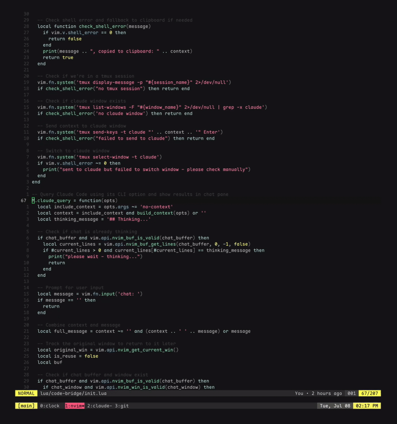

# code-bridge.nvim

A Neovim plugin that provides seamless integration between Neovim and Claude Code, allowing you to
send file context and queries directly to Claude Code from within your Neovim either via CLI or tmux.
Messages can be sent to the agent in another tmux terminal or to a chat buffer split within Neovim.

The goal of this plugin is not to provide the full IDE experience that Claude Code offers. This plugin
aims to make it easy to chat with claude code without running a terminal inside Neovim, and to interact
with a Claude Code session already running in agent mode in another terminal via tmux (or clipboard).



## Features

- **Context Sharing**: Send current file and line ranges to Claude Code
- **Tmux Integration**: Automatically switch to a tmux "claude" window
- **Interactive Chat**: Query Claude Code with persistent chat buffer
- **Fallback Support**: Copies context to clipboard when tmux is unavailable
- **Visual Mode Support**: Send selected line ranges as context

## Requirements

- [Neovim](https://neovim.io/) 0.7+
- [Claude Code CLI](https://github.com/anthropics/claude-code) installed and configured
- [tmux](https://github.com/tmux/tmux) (optional, for automatic window switching)

## Installation

### Using [lazy.nvim](https://github.com/folke/lazy.nvim)

```lua
{
  "samiroy/code-bridge.nvim",
  config = function()
    require('code-bridge').setup()
  end
}
```

### Using [packer.nvim](https://github.com/wbthomason/packer.nvim)

```lua
use {
  "samiroy/code-bridge.nvim",
  config = function()
    require('code-bridge').setup()
  end
}
```

### Manual Installation

Clone this repository to your Neovim configuration directory:
```bash
git clone https://github.com/samiroy/code-bridge.nvim ~/.config/nvim/pack/plugins/start/code-bridge.nvim
```

Then add to your `init.lua`:
```lua
require('code-bridge').setup()
```

## Usage

The plugin provides three main commands:

### `:CodeBridgeTmux`

Sends the current file context to a tmux window named "claude". Works in both normal and visual mode. In case tmux
is not available or there is no window named "claude", the context is copied to the system clipboard.

```vim
" Send current file context
:CodeBridgeTmux

" Send selected lines (in visual mode)
:'<,'>CodeBridgeTmux
```

**Context Format:**
- Normal mode: `@filename.ext`
- Visual mode: `@filename.ext#L1-5`

### `:CodeBridgeQuery`

Opens an interactive chat with Claude Code inside Neovim itself. A persistent markdown buffer for the conversation
is opened in a split pane. Your message along with the file context is sent to Claude Code and the response is
shown in the conversation buffer. Subsequent messages are part of the same chat thread as long as the chat pane
is kept open. Closing the pane clears the chat history.

```vim
" Query with file context
:CodeBridgeQuery

" Query with selected lines as context
:'<,'>CodeBridgeQuery
```

### `:CodeBridgeChat`

Similar to `:CodeBridgeQuery` but without file context - useful for general questions.

```vim
" Chat without file context
:CodeBridgeChat
```

## Tmux Integration

For optimal experience, set up a tmux session with a window named "claude":

```bash
# Create or attach to tmux session
tmux new-session -d -s coding

# Create claude window
tmux new-window -t coding -n claude

# Start Claude Code in the claude window
tmux send-keys -t coding:claude 'claude' Enter
```

The plugin will:
1. Check if you're in a tmux session
2. Look for a window named "claude"
3. Send the context and switch to that window
4. Fall back to clipboard if tmux is unavailable

## Example Workflow

1. Open a file in Neovim
2. Select some lines in visual mode
3. Run `:CodeBridgeQuery`
4. Type your question about the selected code
5. View Claude's response in the chat buffer
6. Continue the conversation with follow-up queries

## Key Bindings (Optional)

Add these to your configuration for quick access:

```lua
vim.keymap.set("n", "<leader>ct", ":CodeBridgeTmux<CR>", { desc = "Send context to claude via tmux" })
vim.keymap.set("v", "<leader>ct", ":CodeBridgeTmux<CR>", { desc = "Send selection to claude via tmux" })
vim.keymap.set("n", "<leader>cq", ":CodeBridgeQuery<CR>", { desc = "Query claude with context" })
vim.keymap.set("v", "<leader>cq", ":CodeBridgeQuery<CR>", { desc = "Query claude with selection" })
vim.keymap.set("n", "<leader>cc", ":CodeBridgeChat<CR>", { desc = "Chat with claude" })
```

## License

Licensed under the GNU General Public License v2.0. See [LICENSE](LICENSE) for details.

## Contributing

Issues and pull requests are welcome! Please ensure your contributions align with the project's goals
of providing a Neovim-Claude integration that does not open a terminal inside Neovim and continue
using existing Claude Code session in another terminal.
